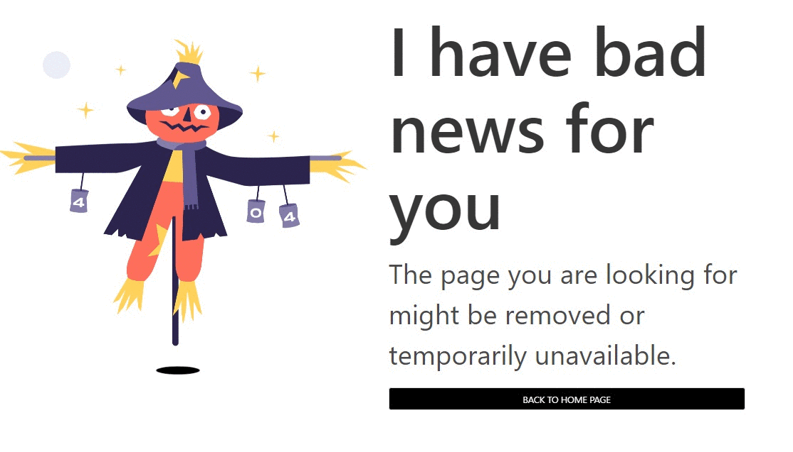

<!-- Please update value in the {}  -->

<h1 align="center">{404 Page - Scarecrow}</h1>

<!-- TABLE OF CONTENTS -->

## Overview

Introduce your projects by taking a screenshot or a gif. Try to tell visitors a story about your project by answering:

Check it out [here](https://weirdyang.github.io/dev-challenge-404/)

### Built With

HMTL and CSS + Bulma

## Features

<!-- List the features of your application or follow the template. Don't share the figma file here :) -->
Added a bounce, credit to [this chill bouncing ghost](https://codepen.io/scoooooooby/pen/pecdI)

## Acknowledgements

<!-- This section should list any articles or add-ons/plugins that helps you to complete the project. This is optional but it will help you in the future. For exmpale -->

- [Steps to replicate a design with only HTML and CSS](https://devchallenges-blogs.web.app/how-to-replicate-design/)
- [Node.js](https://nodejs.org/)
- [Marked - a markdown parser](https://github.com/chjj/marked)

## Contact

- Website [your-website.com](https://{your-web-site-link})
- GitHub [@your-username](https://{github.com/your-usermame})
- Twitter [@your-twitter](https://{twitter.com/your-username})
